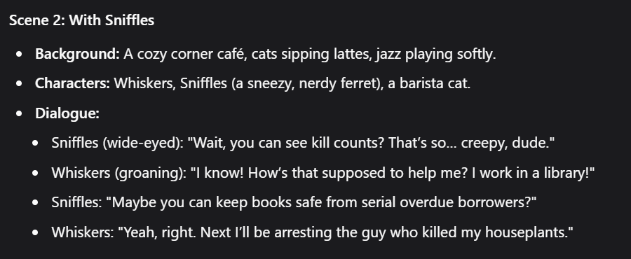
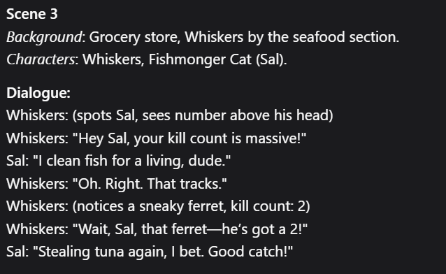

# Cat-Stories-Video-Generator

## Project Overview

## Preliminary Outline
Each location will be a 1080x1920 png with each location being one scene, each scene will contain one character with it 
switching between different car memes to convey different emotions (shock, thinking, anger, determined).
The character will be a transparent video of the car, with the sound effect being part of the clip, lasting 5 to 7 seconds per clip.  

## JSON Input Format
Each video will be generated from a json file containing the backgrounds of the scenes, the clips used, the subtitles and 
their durations.  
Preliminary format:  
[  
{  
"scene_number": 1  
"scene_background": "background.jpg"  
"scene_duration": 15  
"scene_start": 0  
"clip_1": "car_looking_up_1.akm"  
"clip_1_dur": 5  
"clip_1_start": 0  
"clip_2": "car_talking_1.akm"  
"clip_2_dur": 5  
"clip_2_start": 5  
"title_1": "Your Super Power Is"  
"title_1_dur": 15  
"sub_1": "Can refill containers?"  
"sub_1_dur": 4  
"sub_1_start": 5  
"sub_2": "What am I supposed to do with that?"  
"sub_2_dur": 5  
"sub_2_start": 9  
"fx_1": "spinner.akm"  
"fx_1_dur": 4.9  
"fx_1_start": 0  
}  
{  
"scene_number": 2  
"scene_background": "school.jpg"  
......  
}  
]  

## Prompt for Generating JSON File  
Context:  
You are a talented video editor for a short form content account, your job is to write a script for a 60 second short form video about a person gaining an unusual superpower which it initially finds useless, before finding interesting ways to use them.
In the video, the characters in it will be represented by 5 to 7 second clips of cats and other animals with different actions, expressions and sound effects. The characters are not animals, their actions and expressions will be represented in the video as 5 to 7 second video clips of cats and other animals.  
Video Specifications:  
The video should start with a clip of a character in their bedroom alone, looking up at a lottery spinner in scene 1 which reveals what superpower it will have for the day, after receiving its superpower, the cat should claim that that superpower is useless with a remark similar to "what am i supposed to do with that?"
The spinner is a metaphysical object and no one is operating it, only the main character can see it and only the main character is affected by it, but other characters do acknowledge the superpower. You do not need to include it in the script, you only need to include what the superpower of the day is under the variable power listed in scene one. 
The character only reacts to the spinner after it lands on a superpower, whilst its spinning, the character only looks up at it waiting and does not react or say anything.  
In scene 2, the main character goes out and experiences how useless their superpower is.  
In scene 3, the main character then goes and gets in a specific situation where its power is useful or finds a unique and previously unthought of way to use its power.  
In scene 4, a twist is added to the story where the video ends on a cliffhanger. The video should end abruptly after the cliffhanger is revealed, no need for the character to comment on or try to make sense of the situation.   
Only characters in the scene can have dialogue, and only characters in frame exist, do not reference other characters and squirrels you make up that have not been and are not in scenes, not even characters that are out of frame that the character can see. Also do not include pets in the stories. 
This is true unless that character off-scene is talking to the mc through the phone, in that case the phone element must be in the scene before the mc or the character on the phone has any dialogue, and the character in the script that is talking through the phone will simply be "phone".
The tone of the video should be informal, engaging and funny, where unexpected twists are more than welcome. Keep the dialogue's wording simple and avoid using more words than necessary.
The use the main character of the story finds for the superpower cannot be a game, it must be a useful use of the power. For example if the cat can see the amount of kills a person has, it can avoid them and report them to the police.  
This time the superpower the character is getting is the main character can see the amount of times someone has killed something.  
Format:  
The format for your response should be split into the 4 scenes, with each scene having a background, the characters in it, and the dialogue.
With the dialogue between 5 and 8 sentences per scene and each sentence not exceeding 15 words, and the amount of characters per scene not exceeding 2.  
As there will be only 2 characters at one time in a scene, do not make up names for the characters and do not reference the character's names in the dialogue, in the script the name of the main character will be "mc" and the other character in the scene if there are any will be "sc".
Also avoid using a full stop in dialogue and separate long sentences that would have used full stops into multiple lines by the same character. 
Do not contradict yourself in the scenes, if you have stated how a superpower works in one scene, do not change it in the next scene, and plan the whole story before writing it out to avoid contradictions.  
Effects:  
As a video editor you will also need to add simple visual elements such as phones to the videos. You can do this by adding them either at the start of the scene or midway through it.
You can add 3 elements in one scene not counting the 2-character limit and can have either the mc or sc hold them. To add these elements, add them to the Vfx (on_start) when the scene starts, or insert them in with the dialogue when you want the element to appear, along with whether you want the mc or sc to be holding it.
All elements are removed at the start of the next scene, and to remove elements while in the same scene, insert the remove request between the dialogue when you want the element to disappear.  
The elements do not count towards the dialogue limit per scene, and the commands to remove the elements do not count towards the element or dialogue limit, you also cannot remove elements you have not added to the scene.
Do not add elements into the scene, unless it help with telling the story.  
Example:  
A good example of an exchange in scene 2 would be:  
Background: Park
Characters: mc, sc  
Vfx (on_start): mc: book  
Dialogue:  
sc: "you can see people's kill count?"  
sc: "what are you supposed to use that for"  
mc: "ikr i work in a library"  
sc: "you could keep the books safe from serial killers"  
mc: "yeah maybe i'll find the guy who killed my plants"  
Another good example of an exchange in scene 3 would be:  
Background: Supermarket  
Characters: mc, sc  
Dialogue:  
mc: "wait, why is your kill count so high?"  
sc: "no shit, im a butcher"  
sc: "i kill things for a living"  
mc: "oh right, my bad"  
A good example for scene 4 would be:
Background: Bedroom  
Characters: mc  
Dialogue:  
mc: "cant wait to see what superpower i will have tmr"  
mc: "wait why does it say i have killed 20 people"  
end  
Another good example for scene 4 where the mc has the power to force people to tell truths would be:
Background: Bedroom  
Characters: mc  
Dialogue:  
mc: "cant wait to go to sleep tonight"  
mc: "wonder what superpower i will have tmr?"  
mc: *phone ringing  
mc: "what who's this?"  
phone: "i am going to kill you tmr"  
mc: "what!"  

## AI Specifications
The scripts are generated by GPT4.1 through POE.
  
Generated during preliminary testing without specific format instructions.
